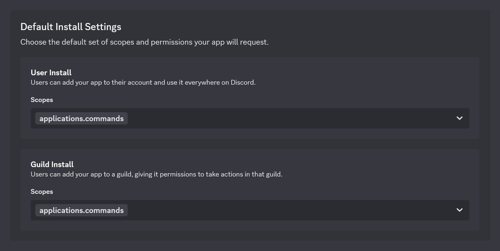

# Contributing Guidelines

## Development Setup

[](https://deploy.workers.cloudflare.com/?url=https%3A%2F%2Fgithub.com%2Fryanlua%2Fdisclip)

> [!TIP]
> This guide is for developers who want to set up their own Disclip clone for development purposes. You can install official Disclip app using the [install link](https://discord.com/oauth2/authorize?client_id=621149242744111114).

It is recommended you [make your first Discord app](https://discord.com/developers/docs/quick-start/getting-started) before you start setting up Disclip so you are familiar with the Discord Developer Portal and how to create an app.

This guide will walk you through the steps to create, configure, and deploy your own Disclip clone to [Cloudflare Workers](https://workers.cloudflare.com/).

### Installing dependencies

> [!NOTE]
> Make sure you have [Node.js](https://nodejs.org/en/download) installed. You can check if you have Node.js by running `node -v`.

Clone the project:

```console
git clone https://github.com/ryanlua/disclip.git
```

Navigate to the cloned directory and install dependencies:

```console
cd Disclip
npm install
```

### Getting app credentials

You will need to [create a Discord app](https://discord.com/developers/applications?new_application=true) in the Discord Developer Portal if you haven't already.

After you create your app, you'll land on the **General Information** page of the app's settings where you can update basic information about your app like its description and icon.

In your code editor, duplicate `.example.dev.vars` and rename it to `.dev.vars` in the root of the project directory.

On your Discord app's settings, enter your app credentials in `.dev.vars`:

* On the **General Information** page, copy the value for **Application ID**. In `.dev.vars`, enter your pasted value in `DISCORD_APPLICATION_ID`

  

* Back on the **General Information** page, copy the value for **Public Key**. In `.dev.vars`, enter your pasted value in `DISCORD_PUBLIC_KEY`

  

* On the **Bot** page under **Token**, click "Reset Token" to generate a new bot token. In `.dev.vars`, enter your pasted value in `DISCORD_TOKEN`

  

> [!WARNING]
> Make sure to never share your token or check it into any kind of version control or someone could take control of your bot.

When you're done, your `.dev.vars` file should look similar to this:

```dotenv
DISCORD_APPLICATION_ID="621149242744111114"
DISCORD_PUBLIC_KEY="445c5654d426763870ecc6060f0a12f983817a33550ad5c0499fc322fdd45072"
DISCORD_TOKEN="NjIxMTQ5TjQyNzQ0MTEyMTE1.GcUa2R.ks2XadvqhA7Q-kQorySUwm2leia8Zkx1mfIqbI"
```

### Configuring your Discord app

You will need to configure your Discord app to allow it to be installed on servers and DMs along with setting up an install link for users to install your app.

#### Installation Contexts

On the **Installation** page, then under **Installation Contexts** make sure both "User Install" and "Guild Install" are selected.


#### Install Link

On the **Installation** page, go to the **Install Link** section and select "Discord Provided Link" if it's not already selected.

When **Discord Provided Link** is selected, a new **Default Install Settings** section will appear, which we'll configure next.


#### Scopes and Bot Permissions

On the **Installation** page in the **Default Install Settings** section:

* For **User Install**, add the `applications.commands` scope
* For **Guild Install**, add the `applications.commands` scope



### Registering commands

In your terminal within the project folder, run the following command:

```console
npm run register
```

The commands will be available in your Discord app after a few minutes. You can test them by typing `/` or right clicking and opening the app context menu in any server or DM where your app is installed. They won't work until you deploy your app to Cloudflare Workers, which we'll do next.

### Deploying to Cloudflare Workers

To deploy your app to Cloudflare Workers:

```console
npm run deploy
```

If you're not logged in to Cloudflare Workers, you'll be prompted to log in. Follow the instructions to log in to your Cloudflare account. Here you can sign up for a free account if you don't have one.

When you finish deploying, you should see a message similar to this:

```console
$ npm run deploy

> disclip@0.0.1 deploy
> wrangler deploy


 ⛅️ wrangler 4.23.0
───────────────────
Total Upload: 216.34 KiB / gzip: 35.86 KiB
Worker Startup Time: 8 ms
Uploaded disclip (1.76 sec)
Deployed disclip triggers (0.18 sec)
  https://disclip.ryanluu.workers.dev
Current Version ID: 25f7cc8e-97b6-4afe-9f7b-c518cea27c29
```

Copy your workers.dev URL from the output, which in this case is `https://disclip.ryanluu.workers.dev`. Your URL will be different.

Go to your app's settings and on the **General Information** page under **Interaction Endpoint URL**, paste your workers.dev URL and append `/interactions`.


Click **Save Changes** and ensure your endpoint is successfully verified.

### Adding your app to servers and DMs

You can now add your app to servers and DMs using the install link generated in the **Install Link** section of the **Installation** page in your app's settings.


Copy the install link and paste it in your browser and click **Add to My Apps** or **Add to Server**.

You now have your own Disclip clone set up and deployed! You can test it by typing `/` or opening the app context menu on any message to clip it.
