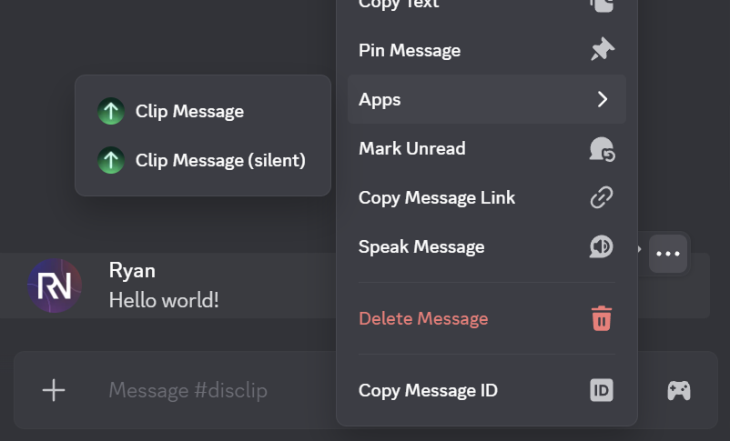

# Disclip

[](https://github.com/RyanLua/Disclip/actions/workflows/ci.yaml)
[](https://discord.gg/XkAHS8MkTe)
[](https://github.com/RyanLua/Disclip?tab=MIT-1-ov-file#readme)
[](https://biomejs.dev)
[](https://app.fossa.com/projects/git%2Bgithub.com%2FRyanLua%2FDisclip?ref=badge_shield)

Save precious messages and funny moments with Disclip. Turn any Discord message into a high-quality image to share across friends and social media.

Disclip is a [Discord app](https://support-apps.discord.com/hc/en-us/articles/26577510840087) that allows you to save any Discord message as an image, including servers and DMs. Written for [Summer of Making](https://summer.hackclub.com/) and [Converge](https://converge.hackclub.com/) from Hack Club.


## Add App

You can add Disclip as a user or server app using the [install link](https://discord.com/oauth2/authorize?client_id=621149242744111114). See the [app on the App Directory](https://discord.com/discovery/applications/621149242744111114) for more.

When you add Disclip, you will be able to clip messages using the context menu (right click or tap) of messages.



Clipped messages will be sent in the same channel as the original message.


## Support Server

If you have any questions, suggestions, or need help with Disclip, feel free to join the support server on Discord.

* Share feedback or your experience
* Get technical support with Disclip
* Be the first to know about updates

[](https://discord.gg/XkAHS8MkTe)

## Publish Server Rules (One-Off)

You can publish a styled rules message (using Discord's Components V2) to a specific channel with a one-off script.

1. Add the following variables to `.dev.vars` (or your environment):

```
DISCORD_TOKEN=YOUR_BOT_TOKEN
RULES_CHANNEL_ID=TARGET_TEXT_CHANNEL_ID
```

2. (Optional) Edit the rule text in `src/publish-rules.js` before sending.
3. Run the script:

```
npm run publish:rules
```

If successful, the script logs the created message ID. You can delete / re-run safely; each invocation posts a new message.

To update rules later, delete the old message in Discord and rerun the script (after editing text if needed).

## License

[](https://app.fossa.com/projects/git%2Bgithub.com%2FRyanLua%2FDisclip?ref=badge_large)
